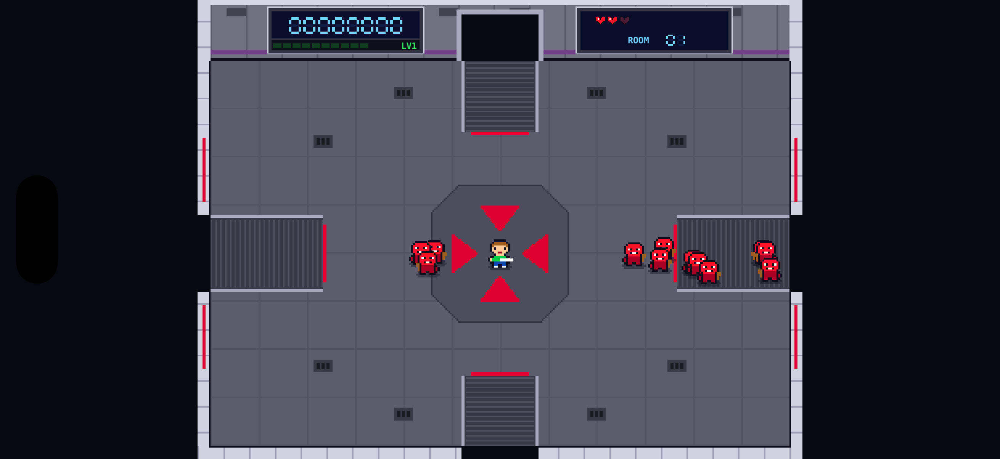

# Ratings War 📺

A twin-stick arena shooter for iPhone, iPad and Mac, built with SpriteKit and SwiftUI. You're a contestant on a deadly game show: survive each room as the mob pours in through the doors, grab the cash, and keep the ratings up.

Inspired by early-90s arcade arena shooters. All code, names and art are original.

  

## Status

First playable build. One arena, endless rooms that get harder, no map or bosses yet.

## Features

- **Twin-stick controls.** Move with one stick and fire in 8 directions with the other, independently.
- **Door-based waves.** Enemies spawn in bursts from doors on all four walls until the room is cleared.
- **Two enemy types.** Fast red grunts, and from Room 2 on, tougher purple bruisers that take four hits.
- **Pickups.** Cash for bonus points, hearts to heal, plus spread shot and rapid fire that last 10 seconds each.
- **16-bit look.** A 3/4 top-down studio with walkways from each door, a centre stage, and LCD scoreboards on the back wall, all pixel art drawn in code.
- **Levelling.** Kills earn XP. Each level adds a heart to your maximum health (up to 10) and refills it, so you grow as the rooms get harder.
- **Rooms and score.** Clear a room for a bonus and move on to a harder one. Run out of hearts and the show is cancelled.

## Controls

| Platform | Move | Fire | Start |
|---|---|---|---|
| iPhone / iPad | Left thumb (stick appears where you touch) | Right thumb | Tap |
| Mac | W A S D | Arrow keys | Space or click |
| Game controller | Left stick or D-pad | Right stick or face buttons | A or Menu |

## Project structure

| File | What it does |
|---|---|
| `MyApp.swift` | App entry point |
| `ContentView.swift` | Hosts the SpriteKit scene in SwiftUI |
| `GameScene.swift` | The game: arena, player, enemies, bullets, pickups, rooms and HUD |
| `PixelArt.swift` | Pixel-art sprites and the arena backdrop, defined as character grids |
| `Input.swift` | Merges touch sticks, keyboard and game controller into move and fire vectors |

## Running it

Open `Ratings War.xcodeproj` in Xcode, choose an iPhone simulator or My Mac, and press Run. There are no third-party dependencies.

## Roadmap

- Room-to-room map with a choice of exits
- Boss fights
- More enemy types and weapons
- Sound and real sprite art
- Two-player co-op
